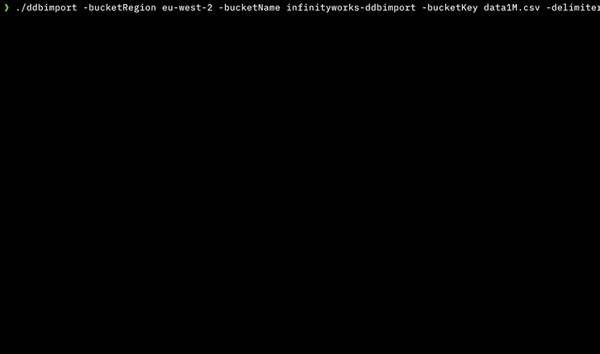
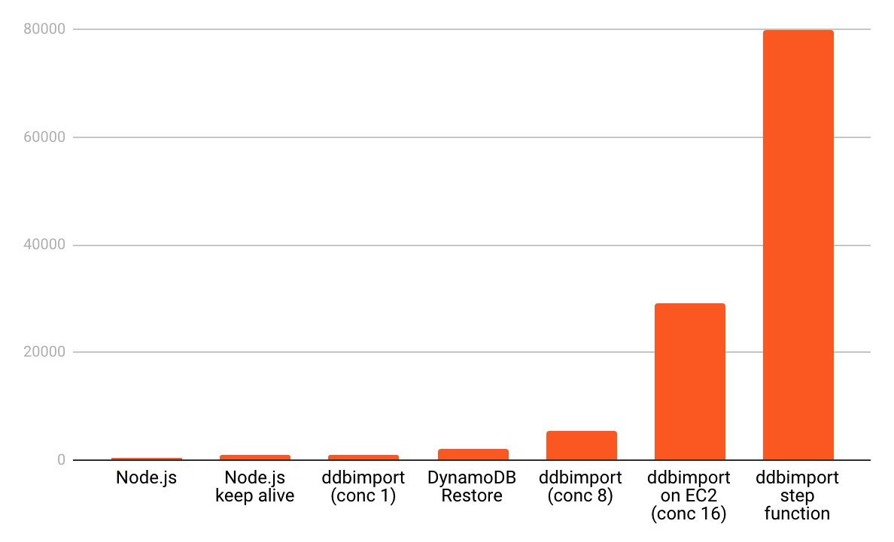

## ddbimport

Import CSV data into DynamoDB.

## Features

* Comma separated (CSV) files
* Tab separated (TSV) files
* Large file sizes
* Local files
* Files on S3
* Parallel imports using AWS Step Functions to import > 4M rows per minute
* No depdendencies (no need for .NET, Python, Node.js, Docker, AWS CLI etc.)



## Warning

This program will use up all available DynamoDB capacity. It is not designed for use against production tables. Use at your own risk.

## Installation

Download binaries for MacOS, Linux and Windows at https://github.com/a-h/ddbimport/releases

A Docker image is available:

```
docker pull adrianhesketh/ddbimport
```

## Building from source

Ensure you have `$GOPATH/bin` in `$PATH` (by default that is `~/go/bin`). This is needed for statik to build the serverless package.
Install a supported version (v12 seems to work fine) of nodejs and npm or yarn.

1. `git clone git@github.com:a-h/ddbimport; cd ddbimport`
2. `yarn global add serverless` or `npm -g install serverless`, whichever you prefer
3. `sls plugin install -n serverless-step-functions`
4. `make -C sls package`
5. `go build -o ddbimport cmd/main.go`


## Usage

### Import local CSV from local computer:

```
ddbimport -inputFile ../data.csv -delimiter tab -numericFields year -tableRegion eu-west-2 -tableName ddbimport
```

### Import S3 file from local computer:

```
ddbimport -bucketRegion eu-west-2 -bucketName infinityworks-ddbimport -bucketKey data1M.csv -delimiter tab -numericFields year -tableRegion eu-west-2 -tableName ddbimport
```

### Import S3 file using remote ddbimport Step Function

```
ddbimport -remote -bucketRegion eu-west-2 -bucketName infinityworks-ddbimport -bucketKey data1M.csv -delimiter tab -numericFields year -tableRegion eu-west-2 -tableName ddbimport
```

### Install ddbimport Step Function

```
ddbimport -install -stepFnRegion=eu-west-2
```

## Benchmarks

Inserts per second of the Google ngram 1 dataset (English).



To reproduce my results.

### Create a DynamoDB table

```
aws dynamodb create-table \
  --table-name ddbimport \
  --attribute-definitions AttributeName=ngram,AttributeType=S AttributeName=year,AttributeType=N \
  --key-schema AttributeName=ngram,KeyType=HASH AttributeName=year,KeyType=RANGE \
  --billing-mode PAY_PER_REQUEST 
```

### Download Google data

```
curl http://storage.googleapis.com/books/ngrams/books/googlebooks-eng-1M-1gram-20090715-0.csv.zip -o 0.csv.zip
```

### Prepare the data

```
# Add the headers.
echo "ngram	year	match_count	page_count	volume_count" > data.csv
# Prepare the data.
unzip 0.csv.zip
cat googlebooks-eng-1M-1gram-20090715-0.csv >> data.csv
rm googlebooks-eng-1M-1gram-20090715-0.csv
```

